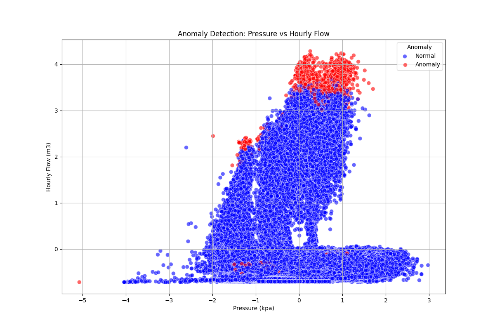
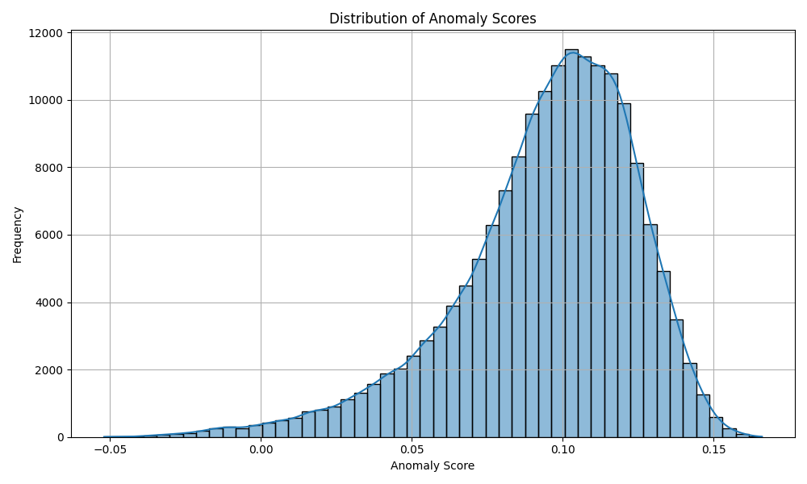
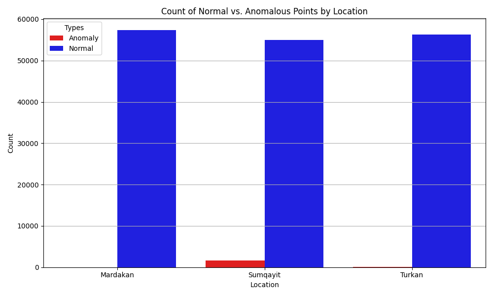
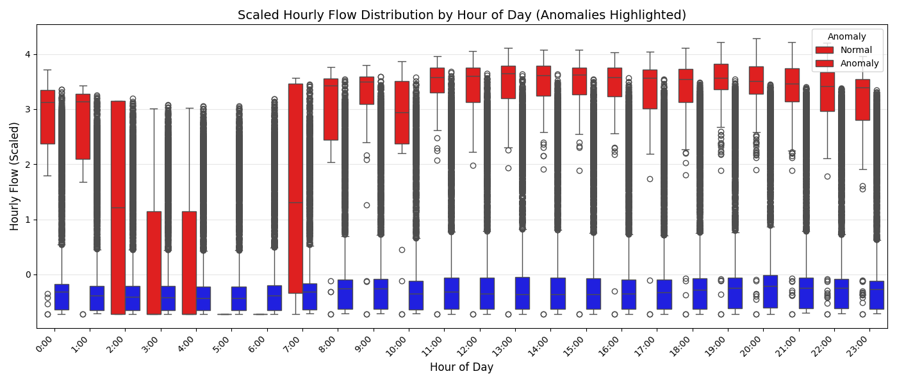
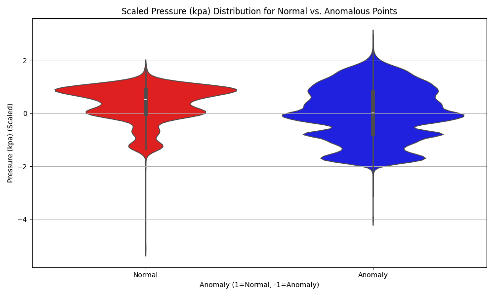

# 🔍 Anomaly Detection in Gas Pipeline Data

A machine learning solution for detecting anomalies in natural gas pipeline sensor data from three monitoring stations in Azerbaijan: **Mardakan**, **Sumqayit**, and **Turkan**.

---

## 📊 Project Overview

This project implements an **Isolation Forest** algorithm to identify unusual patterns in gas pipeline measurements that could indicate equipment malfunctions, leaks, or operational issues.

| Metric | Value |
|--------|-------|
| **Total Records** | ~174,000 hourly readings |
| **Time Period** | 2018 onwards |
| **Monitoring Stations** | 3 locations |
| **Anomaly Detection Rate** | 1% (contamination threshold) |

---

## 🔬 Data Features

| Feature | Description | Unit |
|---------|-------------|------|
| `density_kg_m3` | Gas specific gravity | kg/m³ |
| `pressure_diff_kpa` | Pressure differential | kPa |
| `pressure_kpa` | Absolute pressure | kPa |
| `temperature_c` | Gas temperature | °C |
| `hourly_flow_m3` | Hourly gas flow rate | m³/min |
| `total_flow_m3` | Cumulative flow | m³ |

---

## 📈 Analysis Results & Insights

### 1. Anomaly Detection Overview

The scatter plot below shows the relationship between **pressure** and **hourly flow rate**, with anomalies highlighted in red. This visualization reveals where abnormal operating conditions occur.



**Key Insights:**
- 🔴 **Anomalies** (red points) cluster at extreme values of both pressure and flow
- 🔵 **Normal operations** (blue points) form a dense central cluster
- Anomalies appear at both unusually high and low flow rates
- Pressure extremes (both high and low) correlate with anomalous readings

---

### 2. Anomaly Score Distribution

The histogram below shows the distribution of anomaly scores calculated by the Isolation Forest model. Lower scores indicate higher likelihood of being an anomaly.



**Key Insights:**
- The majority of data points have **positive anomaly scores** (normal behavior)
- A clear threshold separates normal operations from anomalies
- The distribution is **right-skewed**, indicating most readings are within normal parameters
- Outliers with negative scores are flagged for further investigation

---

### 3. Anomalies by Location

This chart compares the count of normal vs. anomalous data points across the three monitoring stations.



**Key Insights:**
- **Sumqayit** shows slightly higher anomaly counts compared to other locations
- All three locations have roughly similar proportions of anomalies (~1%)
- The distribution suggests the anomaly detection model generalizes well across locations
- Location-specific factors may require targeted investigation

---

### 4. Hourly Flow Patterns

The box plot below shows hourly gas flow distribution by hour of day, with anomalies highlighted in red.



**Key Insights:**
- **Peak consumption hours** (8:00-22:00) show higher variability
- **Night hours** (00:00-06:00) have more stable, lower flow rates
- Anomalies appear across all hours but are more pronounced during **high-demand periods**
- Extreme flow values (both high and low) are flagged as anomalies regardless of time

---

### 5. Pressure Distribution Analysis

The violin plot below compares pressure distributions between normal and anomalous data points.



**Key Insights:**
- **Normal readings** show a concentrated, symmetrical pressure distribution
- **Anomalous readings** display a wider, more dispersed distribution
- Pressure extremes (very high or very low) strongly correlate with anomaly classification
- The model effectively captures pressure-related operational issues

---

## 🛠️ Technical Implementation

### Pipeline Architecture

```
┌─────────────┐    ┌──────────────┐    ┌─────────────┐    ┌────────────┐
│  Raw Data   │───▶│ Preprocessing│───▶│  Feature    │───▶│ Isolation  │
│  (3 CSVs)   │    │  & Cleaning  │    │ Engineering │    │  Forest    │
└─────────────┘    └──────────────┘    └─────────────┘    └────────────┘
                                                                │
                   ┌──────────────┐    ┌─────────────┐         ▼
                   │ Saved Model  │◀───│  Anomaly    │◀────────┘
                   │  (.joblib)   │    │  Scoring    │
                   └──────────────┘    └─────────────┘
```

### Key Technologies

| Component | Technology |
|-----------|------------|
| Data Processing | `pandas` |
| Machine Learning | `scikit-learn` (Isolation Forest) |
| Visualization | `matplotlib`, `seaborn` |
| Model Persistence | `joblib` |

---

## 🚀 Usage

### Load the Pre-trained Model

```python
import joblib
import pandas as pd

# Load model
model = joblib.load('models/isolation_forest_model.joblib')

# Prepare new data (example)
new_data = pd.DataFrame({
    'density_kg_m3': [0.75],
    'pressure_diff_kpa': [5.0],
    'pressure_kpa': [600.0],
    'temperature_c': [12.0],
    'hourly_flow_m3': [5.0],
    'total_flow_m3': [120.0],
    # ... add engineered features
})

# Predict
prediction = model.predict(new_data)
# -1 = Anomaly, 1 = Normal
```

---

## 📁 Project Structure

```
anomalies_in_gas_pipeline/
├── 📂 data/
│   ├── Mardakan.csv      # 57,982 records
│   ├── Sumqayit.csv      # 58,015 records
│   └── Turkan.csv        # 57,982 records
├── 📂 charts/
│   ├── anomaly_detection.png
│   ├── anomaly_score_distribution.png
│   ├── anomalies_by_location.png
│   ├── hourly_flow_by_hour_anomalies.png
│   └── pressure_distribution_anomalies.png
├── 📂 models/
│   └── isolation_forest_model.joblib
├── 📂 notebooks/
│   └── analyse.ipynb     # Full analysis notebook
└── README.md
```

---

## 📌 Conclusions

1. **Effective Detection**: The Isolation Forest model successfully identifies ~1% of readings as anomalous
2. **Pressure is Key**: Pressure measurements are strong indicators of anomalous behavior
3. **Temporal Patterns**: Anomalies cluster during peak usage hours
4. **Location Consistency**: The model performs consistently across all three monitoring stations
5. **Actionable Insights**: Flagged anomalies can guide preventive maintenance and safety inspections

---

## 📄 License

MIT License - Feel free to use and modify for your own pipeline monitoring needs.

---

*Built with 🔧 Python | Data from Azerbaijan Gas Pipeline Monitoring System*
